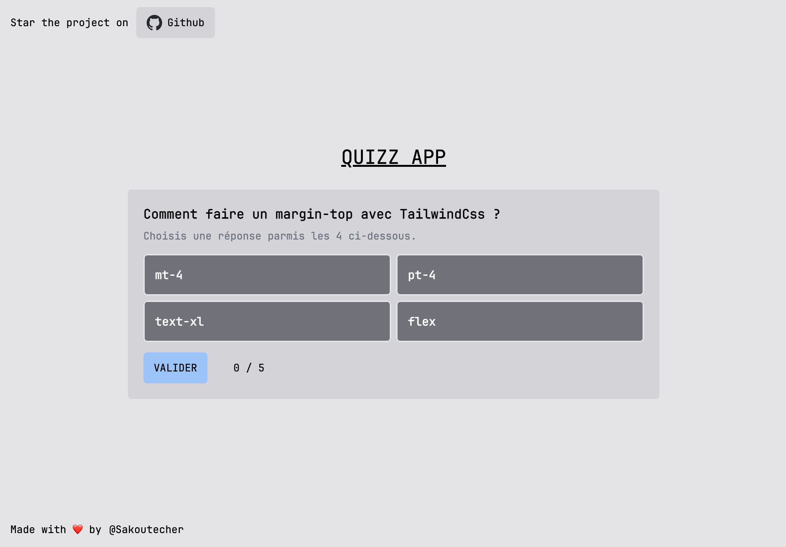

# Quizz App



## Description

This is a quizz app, you can change all the questions and the answers, just look at the documentation. You can save score in the local storage and see all scores in the scoreboard. Feel free to drop a ⭐ on the repo or contribute ! 😎

## Summary

- [Description](#description)
- [Technology Stack](#technology-stack)
- [Command](#command)
- [Change question and answers](#change-question-and-answers)
- [Author](#author)

## Technology Stack

[](https://github-readme-tech-stack.vercel.app/api/cards?lineCount=2&hideTitle=true&line1=react,react,926cbc;styledcomponents,styledcomponents,f6df4c;framer,framer,8e290a;&line2=typescript,typescript,c1e609;vite,vite,1c89d2;vitest,vitest,adc5c5;jest,jest,43eb8c;)

## Command

To use this project :

This move to a folder where you want to place this project and copy the project there :

```bash
git clone https://github.com/Sakoutecher/portfolio-newt.git
```

Then you have to install all dependencies, you can do it with the npm package manager or pnpm, it is according to your preferences, for this you have to use this command :

```bash
npm install or pnpm install
```

Once this is done, you only have to start the project by executing the command :

```bash
npm run dev
```

## Change question and answers

Go to the file **quizz-data.ts**

Path to the file `src/data/quizz-data.ts`

Now in the const `quizzData` you can modify or add new object, but you have to follow this model :

```json
{
  question: Put here the question
  answers: [
    //Here you need to put 4 objects
    {
      answer: The answer you will show on the quizz
      response: True if it's the right answer, false if it's the wrong
    }
  ]
}
```

## Author

- [@Sakoutecher](https://github.com/Sakoutecher)
